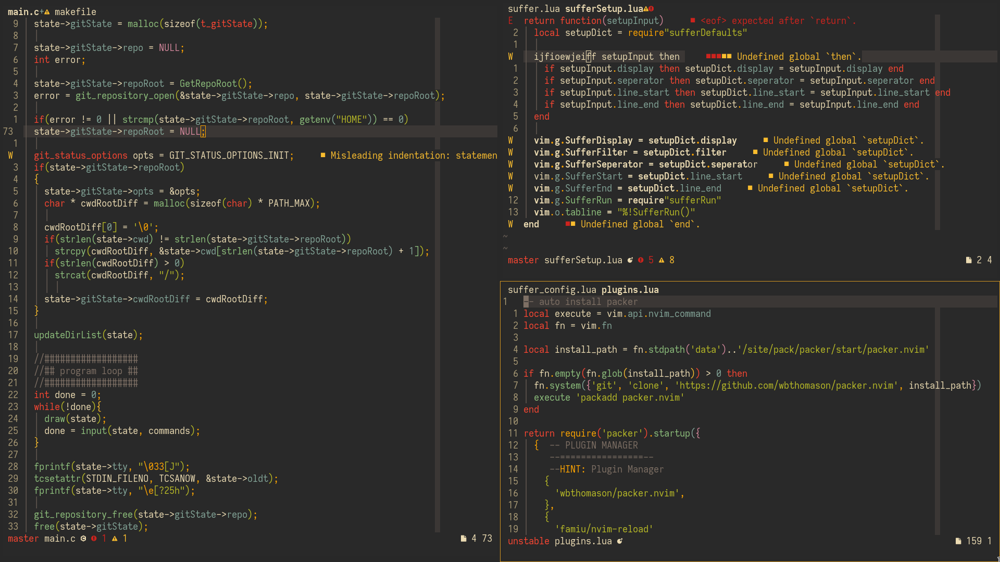
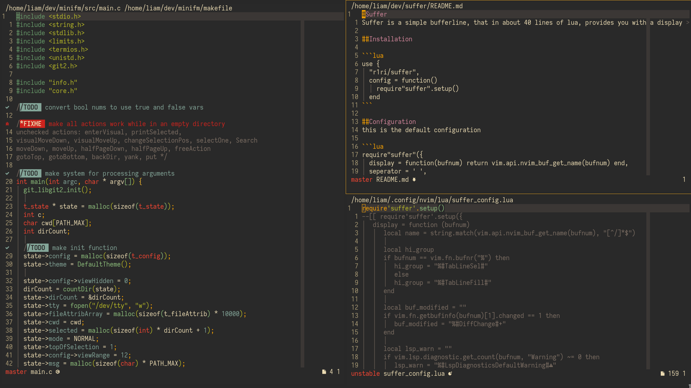

# Suffer
Suffer is a simple bufferline plugin, in less the 30 lines of lua it provides a display function meant to be overwritten.

## Installation

```lua
use {
  "r1ri/suffer",
  config = function()
    require"suffer".setup()
    vim.o.showtabline = 2
  end
}
```

## Configuration
this is the default configuration

```lua
require"suffer"({
  display = function(bufnum) return vim.api.nvim_buf_get_name(bufnum) end,
  seperator = ' ',
  line_start = ' ',
  line_end = ' '
})
```

## Screenshots

My config:


Default config:


## My Config

```lua
require'suffer'.setup({
   display = function (bufnum)
      local name = string.match(vim.api.nvim_buf_get_name(bufnum), "[^/]*$")

      local hi_group
      if bufnum == vim.fn.bufnr("%") then
         hi_group = "%#TabLineSel#"
         else
         hi_group = "%#TabLineFill#"
      end

      local buf_modified = ""
      if vim.fn.getbufinfo(bufnum)[1].changed == 1 then
         buf_modified = "%#DiffChange#+"
      end

      local lsp_warn = ""
      if vim.lsp.diagnostic.get_count(bufnum, "Warning") ~= 0 then
         lsp_warn = "%#LspDiagnosticsDefaultWarning#"
      end

      local lsp_error = ""
      if vim.lsp.diagnostic.get_count(bufnum, "Error") ~= 0 then
         lsp_error = "%#LspDiagnosticsDefaultError#"
      end

      return hi_group .. name .. buf_modified .. lsp_warn .. lsp_error .. "%#TabLine#"
   end
})
```
